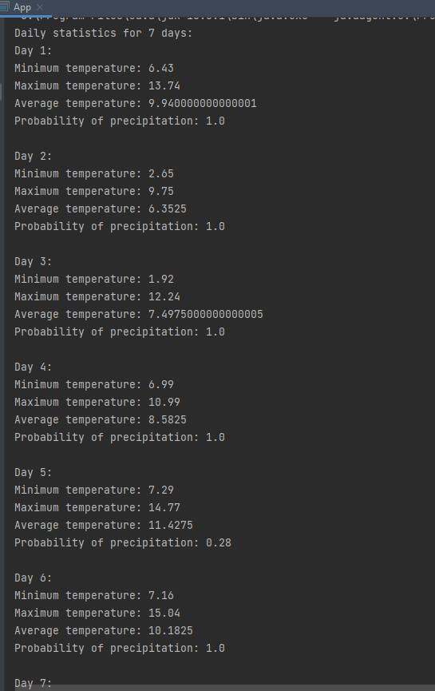
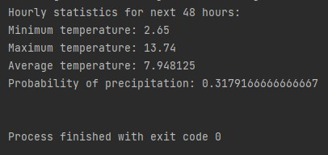

# Weather Console Application

- Author: Daria Komarynska

- Recruitment Task from Tink Company

#### It is a terminal console Java application, integrated with OpenWeatherMap. 

#### Here are some results of running application:
 

- Running daily forecast with arguments `.\src\main\java\application\Cities daily warsaw`

- Running daily forecast with arguments `.\src\main\java\application\Cities hourly warsaw`

To build and run this application I used:
- Java SDK 16
- Maven 
- Intellij Idea
- Account on OpenWeatherMap to get API key

Running an application is possible for example by command:

`java path\App.java path\TestCities.csv daily warsaw`

- Argument[0] - Test file with cities and coordinates to them
- Argument[1] - daily/hourly - type of forecast
- Argument[2] - Name of city to get forecast
